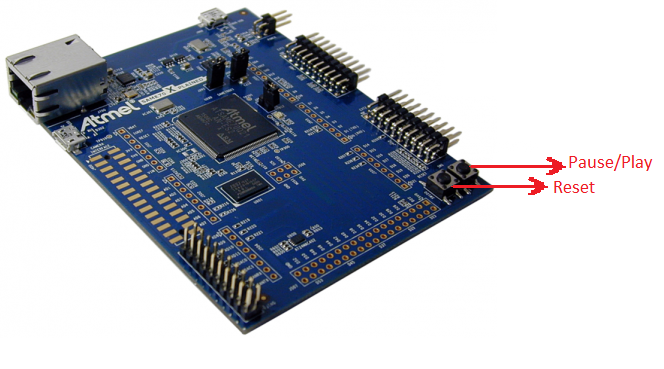
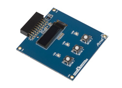

<!-- PROJECT LOGO -->
 

  <h3 align="center">APS 1</h3>

  

    Computacao Embarcada
     
    <a href="https://github.com/insper-classroom/21a-emb-aps-1-eiki-bilbia"><strong>Explore os Arquivos »</strong></a>
     
     
  

<!-- TABLE OF CONTENTS -->

  
<h2 style="display: inline-block">Sumário</h2>

  <ol>
    <li>
      <a href="#about-the-project">Sobre o Projeto</a>
    </li>
    <li>
      <a href="#getting-started">Infraestrutura</a>
    </li>
    <li><a href="#usage">Projeto</a></li>
  </ol>

<!-- ABOUT THE PROJECT -->
## Sobre o Projeto

O objetivo do projeto é reproduzir músicas monofonicas, que são aquelas que só possuem uma única nota tocada por vez.

<!-- GETTING STARTED -->
## Infraestrutura

Para criar o dispositivo embarcado utilizou-se o microcontrolador ATSAME70Q21, um ARM Cortex M7.

 Foi utilizado
o OLED1 Xplained Pro, para permitir a comunicação com o usuário através da tela e dos três botões embutidos na extensão.
Um buzzer também foi utilizado para a reprodução das notas musicais. 

## Projeto

Para reproduzir as músicas monofonicas com o buzzer, foi necessário implementar uma função que controla a frequência das
vibrações e considere também o tempo de duração de cada nota. 

<!-- CONTRIBUTING -->
## Video

[Video de Demonstração no Youtube](https://www.youtube.com/watch?v=4Uk_XwgxECI "Video Demo")

<!-- LICENSE -->
## License

Distributed under the MIT License. See `LICENSE` for more information.

<!-- CONTACT -->
## Alunos

Eiki Luis Yamashiro: [GitHub](github.com/EikiYamashiro/), eikily@al.insper.edu.br

Beatriz Muniz: [GitHub](https://github.com/Bilbia/), beatrizmcs@al.insper.edu.br

